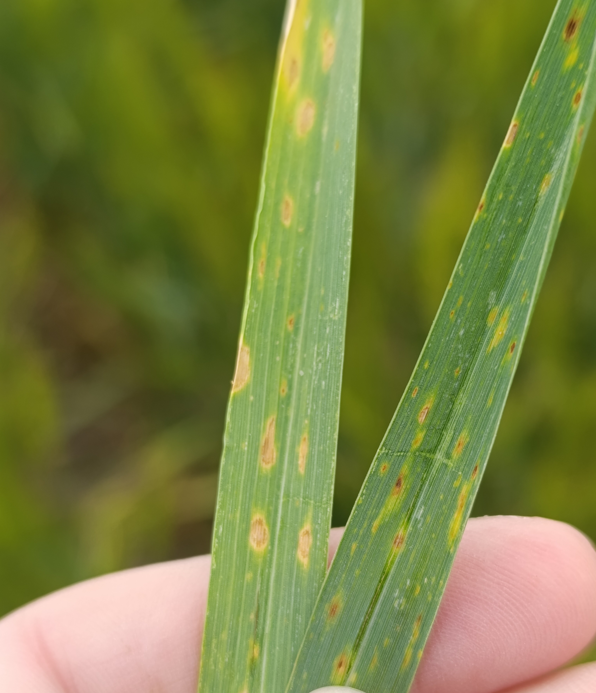

:::{.column-margin}

:::
```{r}
library(writexl)
library(gsheet)
library(r4pde)
library(tidyverse)
library(ggdendro)
library(ggrepel)
library(cluster)
library(mclust)   # adjustedRandIndex
library(dplyr)
library(emmeans)
library(multcomp)
library(multcompView)
library(mgcv)
library(nlme)
library(dendextend)
library(patchwork)
library(DHARMa)
# Data Loading


dat_raw <- gsheet2tbl("https://docs.google.com/spreadsheets/d/1KGolCesLlgn2TGS-YcuKtdqNVJ4OnkdG/edit?gid=1573255184#gid=1573255184")
dat_raw <- dat_raw %>%
  mutate(Genotype = recode(Genotype,
                           "BRS Gralha Azul" = "BRS GAzul",
                           "ORS Madreperola" = "ORS MPerola"))
# Data Cleaning and Preparation
dat_all <- dat_raw %>%
  mutate(
    geno = str_squish(as.character(Genotype)),
    env  = str_squish(as.character(Env)),
    time = as.numeric(Zadoks),
    tan_spot  = as.numeric(Tan_spot),
    rust = as.numeric(rust),
    powdery_mildew = as.numeric(powdery_mildew)) %>%
  filter(
    geno %in% Genotype,
    !is.na(env), env != "",
    !is.na(time),
    !is.na(tan_spot),
    !is.na(rust),
    !is.na(powdery_mildew),) %>%
  arrange(env, geno, time)

t =dat_all %>%
  group_by(env,geno) %>%
  summarise(n_zadoks = n_distinct(time),
            .groups = "drop")
###fILTER GENOTYPES THAT WAS EVALUATED IN >2 LOCAL AND >3 YEAR#########
filtered_data <- dat_all %>%
  #filter(!is.na(time)) %>%
  #group_by(geno, env, tan_spot) %>%
  #filter(n_distinct(time) >= 5) %>%
  #ungroup() %>%
  group_by(geno) %>%
  filter(
    n_distinct(Local) >= 4,
    n_distinct(Year)  >= 3) %>%
  ungroup()


filtered_data %>%
  distinct(geno) %>%
  arrange(geno) |> 
  print(n = Inf)
n_distinct(filtered_data$geno)


genotype_env_count <- filtered_data %>%
  group_by(geno) %>%
  summarise(
    n_env   = n_distinct(env),
    n_year  = n_distinct(Year),
    n_local = n_distinct(Local),
    .groups = "drop") %>%
  arrange(desc(n_env))

genotype_env_count
#write_xlsx(genotype_env_count, "genotype_environment_count.xlsx")
###############
# Filtering the enviromental with sev>10
############
final_sev <- filtered_data %>%
  group_by(env, geno) %>%
  filter(time == max(time, na.rm = TRUE)) %>%
  summarise(final_sev_ts = max(tan_spot, na.rm = TRUE), .groups = "drop")

env_valid <- final_sev %>%
  group_by(env) %>%
  summarise(max_final_ts = max(final_sev_ts, na.rm = TRUE), .groups = "drop") %>%
  filter(max_final_ts > 10)

dat_env <- filtered_data %>%
  filter(env %in% env_valid$env) %>%
  arrange(env, geno, time)
n_distinct(dat_env$geno)


dat_env %>%
  distinct(geno) %>%
  arrange(geno) |> 
  print(n = Inf)


# Breeder Resistance Classes (Scalar-based)
# ---------------------------
resistencia_tbl <- tribble(
  ~geno,              ~aacpd_cl, ~severity_cl,
  "Bar 10",           "MR",      "MR",
  "BRS GAzul",        "MS",      "MS",
  "BRS Sanhaco",      "MS",      "MS",
  "BRS TR133",        "MS",      "MS",
  "BRS TR733",        "HS",      "MS",
  "ORS 1403",         "MR",      "MR",
  "ORS Feroz",        "MR",      "MR",
  "ORS MPerola",      "MR",      "MR",
  "ORS Selvagem",     "MS",      "MS",
  "ORS Senna",        "HS",      "HS",
  "ORS Soberano",     "MR",      "MR",
  "ORS Turbo",        "MR",      "MR",
  "TBIO Aton",        "HS",      "HS",
  "TBIO Audaz",       "MR",      "MR",
  "TBIO Blanc",       "MR",      "MR",
  "TBIO Calibre",     "MR",      "MR",
  "TBIO Capaz",       "MR",      "MR",
  "TBIO Duque",       "MR",      "MR",
  "TBIO Motriz",      "MR",      "MR",
  "TBIO Ponteiro",    "MR",      "MR",
  "TBIO Sossego",     "MR",      "MR",
  "TBIO Talisma",     "MR",      "MR",
  "TBIO Titan",       "MS",      "MR",
  "TBIO Toruk",       "MS",      "MR",
  "TBIO Trunfo",      "MR",      "MR"
) 

cultivars <- resistencia_tbl$geno


geno_class <- resistencia_tbl %>%
  mutate(
    geno = str_squish(geno),
    aacpd_cl = factor(aacpd_cl, levels = c("MR", "MS", "HS"), ordered = TRUE),
    severity_cl = factor(severity_cl, levels = c("MR", "MS", "HS"), ordered = TRUE))
#### Retaining Selected Genotypes and Joining Breeder Classes

dat_env <- dat_env %>%
  mutate(geno = str_squish(geno))

resistencia_tbl <- resistencia_tbl %>%
  mutate(geno = str_squish(geno))

dat_env_filtrado <- dat_env %>%
  filter(geno %in% resistencia_tbl$geno)

dat_env_final <- dat_env_filtrado %>%
  left_join(resistencia_tbl, by = "geno")

n_distinct(dat_env_final$geno)
n_distinct(dat_env_final$env)

######
# Aligning Disease Progress Curves to Zadoks Growth Scale

####

dae_min <- 20
dae_max <- 90

starts <- dat_env_final %>%
  filter(between(time, dae_min, dae_max)) %>%
  group_by(env, geno) %>%
  summarise(
    t_pos = {
      v <- time[tan_spot > 0]
      if (length(v) == 0) NA_real_ else min(v)},
    t_zero_prev = {
      if (is.na(t_pos)) NA_real_ else {
        v0 <- time[time < t_pos]
        if (length(v0) == 0) NA_real_ else max(v0)
      }
    },
    t_start = dplyr::coalesce(t_zero_prev, t_pos),
    .groups = "drop")

dat_trim <- dat_env_final %>%
  filter(between(time, dae_min, dae_max)) %>%
  left_join(starts %>% dplyr::select(env, geno, t_start), by = c("env", "geno")) %>%
  filter(is.na(t_start) | time >= t_start) %>%
  dplyr::select(-t_start) %>%
  arrange(env, geno, time)

# Convert to proportion for compare_curves()
dat_ready <- dat_trim %>%
  mutate(y = tan_spot / 100)
n <- nrow(dat_ready)

# Severity Transformation (Smithson & Verkuilen)
dat_ready$y <- (dat_ready$y * (n - 1) + 0.5) / n


#ggsave("genotype_env.png", width = 10, height = 8, bg = "white", dpi = 1000)

# ---------------------------
# Hierarchical Generalized Additive Model (HGAM) Fitting
# ---------------------------
n_distinct(dat_ready$geno)

dat_ready <- dat_ready %>%
  mutate(curve_id = interaction(env, geno, drop = TRUE))
str(dat_ready)


dat_ready <- dat_ready %>%
  mutate(
    env = factor(env),
    geno = factor(geno),
    curve_id = factor(curve_id),
    time = as.numeric(time))

## Scalar Model (Final Severity)
final_dat <- dat_ready %>%
  dplyr::group_by(env, geno) %>%
  dplyr::filter(time == max(time, na.rm = TRUE)) %>%
  dplyr::summarise(
    y_final = mean(y, na.rm = TRUE),
    .groups = "drop") %>%
  dplyr::mutate(
    env = as.factor(env),
    geno = as.factor(geno))


## Beta regression model for final severity


m_final <- gam(
  y_final ~ geno + s(env, bs = "re"),
  data = final_dat,
  family = betar(link = "logit"),
  method = "REML")

summary(m_final)
gam.check(m_final)


emm_final <- emmeans(
  m_final,
  ~ geno,
  type = "response")

emm_final_df <- as.data.frame(emm_final) %>%
  dplyr::mutate(
    response_pct = response * 100,
    lower_pct = lower.CL * 100,
    upper_pct = upper.CL * 100) %>%
  dplyr::arrange(response_pct)


sev_vec <- emm_final_df$response_pct
names(sev_vec) <- as.character(emm_final_df$geno)

dist_sev <- dist(sev_vec)

hc_sev <- hclust(
  dist_sev,
  method = "ward.D2")

groups_sev <- cutree(hc_sev, k = 3)

class_final_df <- data.frame(
  geno = names(groups_sev),
  group_num = as.numeric(groups_sev),
  response_pct = as.numeric(sev_vec[names(groups_sev)])) %>%
  dplyr::group_by(group_num) %>%
  dplyr::mutate(mean_group = mean(response_pct, na.rm = TRUE)) %>%
  dplyr::ungroup() %>%
  dplyr::distinct(group_num, mean_group) %>%
  dplyr::arrange(mean_group) %>%
  dplyr::mutate(
    sev_class = c("MR", "MS", "HS")) %>%
  dplyr::right_join(
    data.frame(
      geno = names(groups_sev),
      group_num = as.numeric(groups_sev),
      response_pct = as.numeric(sev_vec[names(groups_sev)])),
    by = "group_num") %>%
  dplyr::arrange(response_pct)

class_final_df

emm_final_df <- emm_final_df %>%
  dplyr::mutate(geno_chr = as.character(geno)) %>%
  dplyr::left_join(
    class_final_df %>% dplyr::select(geno, sev_class),
    by = c("geno_chr" = "geno")) %>%
  dplyr::arrange(response_pct) %>%
  dplyr::mutate(
    geno = factor(geno_chr, levels = geno_chr),
    sev_class = factor(sev_class, levels = c("MR", "MS", "HS")))

class_cols <- c(
  "MR" = "#3A7CA5",
  "MS" = "#f7c841",
  "HS" = "#C11C84")

dend_sev <- as.dendrogram(hc_sev)

leaf_order <- labels(dend_sev)

cluster_order <- unique(groups_sev[leaf_order])

class_by_group <- class_final_df %>%
  dplyr::distinct(group_num, sev_class)

cols_for_dend <- class_by_group$sev_class[
  match(cluster_order, class_by_group$group_num)
]

cols_for_dend <- class_cols[cols_for_dend]

dend_sev_col <- dend_sev %>%
  color_branches(
    k = 3,
    col = cols_for_dend) %>%
  set("labels_cex", 0.8) %>%
  set("branches_lwd", 2)

p_dend_final <- wrap_elements(
  full = ~{
    par(mar = c(6, 4, 1, 1))
    plot(
      dend_sev_col,
      main = "",
      ylab = "Height",
      xlab = "",
      sub = ""
    ) })


p_final_class <- ggplot(
  emm_final_df,
  aes(x = geno, y = response_pct, color = sev_class)) +
  geom_point(size = 3) +
  geom_errorbar(
    aes(ymin = lower_pct, ymax = upper_pct),
    width = 0.2) +
  scale_color_manual(values = class_cols) +
  coord_flip() +
  labs(
    x = "Genotype",
    y = "Model-adjusted final severity (%)",
    color = "Class",
    title = "") +
  theme_bw() +
  theme(
    legend.position = "bottom",
    axis.text.y = element_text(size = 10),
    axis.text.x = element_text(size = 10))

p_final_class|p_dend_final
# ggsave("sev_ts.png", width = 13, height = 11, bg = "white", dpi = 1000)

####         AACPD    ############

dat_ready <- dat_ready %>%
  mutate(
    y_orig = tan_spot / 100)

audpc_fun <- function(time, y) {
  ord <- order(time)
  time <- time[ord]
  y <- y[ord]
  
  sum(diff(time) * (head(y, -1) + tail(y, -1)) / 2, na.rm = TRUE)}


aacpd_dat <- dat_ready %>%
  dplyr::filter(
    !is.na(time),
    !is.na(y_orig),
    !is.na(env),
    !is.na(geno)) %>%
  dplyr::group_by(env, geno) %>%
  dplyr::summarise(
    aacpd = audpc_fun(time, y_orig) * 100,  
    n_eval = n_distinct(time),
    time_min = min(time),
    time_max = max(time),
    .groups = "drop") %>%
  dplyr::mutate(
    env = as.factor(env),
    geno = as.factor(geno))

aacpd_dat %>% count(n_eval)
aacpd_dat %>% count(time_min, time_max)

aacpd_dat <- aacpd_dat %>%
  mutate(log_aacpd = log(aacpd + 1))
m_aacpd <- gam(
  log_aacpd ~ geno + s(env, bs = "re"),
  data = aacpd_dat,
  family = gaussian(),
  method = "REML")
gam.check(m_aacpd)
summary(m_aacpd)

emm_aacpd <- emmeans(m_aacpd, ~ geno)

emm_aacpd_df <- as.data.frame(emm_aacpd) %>%
  dplyr::mutate(
    emmean_orig = exp(emmean) - 1,
    lower_orig  = exp(lower.CL) - 1,
    upper_orig  = exp(upper.CL) - 1) %>%
  dplyr::arrange(emmean_orig)

aacpd_vec <- emm_aacpd_df$emmean_orig
names(aacpd_vec) <- as.character(emm_aacpd_df$geno)

dist_aacpd <- dist(aacpd_vec)

hc_aacpd <- hclust(
  dist_aacpd,
  method = "ward.D2")

groups_aacpd <- cutree(hc_aacpd, k = 3)


class_df <- data.frame(
  geno = names(groups_aacpd),
  group_num = as.numeric(groups_aacpd),
  emmean_orig = as.numeric(aacpd_vec[names(groups_aacpd)])) %>%
  dplyr::group_by(group_num) %>%
  dplyr::mutate(mean_group = mean(emmean_orig, na.rm = TRUE)) %>%
  dplyr::ungroup() %>%
  dplyr::distinct(group_num, mean_group) %>%
  dplyr::arrange(mean_group) %>%
  dplyr::mutate(
    aacpd_class = c("MR", "MS", "HS")) %>%
  dplyr::right_join(
    data.frame(
      geno = names(groups_aacpd),
      group_num = as.numeric(groups_aacpd),
      emmean_orig = as.numeric(aacpd_vec[names(groups_aacpd)])),
    by = "group_num") %>%
  dplyr::arrange(emmean_orig)

# Joining classes to adjusted means
emm_aacpd_df <- emm_aacpd_df %>%
  dplyr::mutate(geno_chr = as.character(geno)) %>%
  dplyr::left_join(
    class_df %>% dplyr::select(geno, aacpd_class),
    by = c("geno_chr" = "geno") ) %>%
  dplyr::arrange(emmean_orig) %>%
  dplyr::mutate(
    geno = factor(geno_chr, levels = geno_chr),
    aacpd_class = factor(aacpd_class, levels = c("MR", "MS", "HS")))

class_cols <- c(
  "MR" = "#3A7CA5",
  "MS" = "#f7c841",
  "HS" = "#C11C84")

dend_aacpd <- as.dendrogram(hc_aacpd)

leaf_order <- labels(dend_aacpd)

cluster_order <- unique(groups_aacpd[leaf_order])

class_by_group <- class_df %>%
  dplyr::distinct(group_num, aacpd_class)

cols_for_dend <- class_by_group$aacpd_class[
  match(cluster_order, class_by_group$group_num)
]

cols_for_dend <- class_cols[cols_for_dend]

dend_aacpd_col <- dend_aacpd %>%
  color_branches(
    k = 3,
    col = cols_for_dend) %>%
  set("labels_cex", 0.8) %>%
  set("branches_lwd", 2)

library(patchwork)

p_dend <- wrap_elements(
  full = ~{
    par(mar = c(6, 4, 1, 1))
    plot(
      dend_aacpd_col,
      main = "",
      ylab = "Height",
      xlab = "",
      sub = "")})


p_aacpd_class <- ggplot(
  emm_aacpd_df,
  aes(x = geno, y = emmean_orig, color = aacpd_class)) +
  geom_point(size = 3) +
  geom_errorbar(
    aes(ymin = lower_orig, ymax = upper_orig),
    width = 0.2) +
  scale_color_manual(values = class_cols) +
  coord_flip() +
  labs(
    x = "Genotype",
    y = "Model-adjusted AUDPC",
    color = "",
    title = "") +
  theme_bw() +
  theme(
    legend.position = "none",
    axis.text.y = element_text(size = 10),
    axis.text.x = element_text(size = 10))

(p_aacpd_class|p_dend)/
(p_final_class|p_dend_final)+plot_annotation(tag_levels = "A")

# ggsave("aacpd_sev_ts.png", width = 13, height = 11, bg = "white", dpi = 1000)


## Functional Model (Curve Comparison)
set.seed(1)
m1 <- r4pde::compare_curves(
  data          = dat_ready,
  time          = "time",
  response      = "y",
  treatment     = "geno",
  environment   = "env",
  cluster_k     = 3,
  show_progress = TRUE,
  perm_unit     = "geno",
  perm_strata   = "env",
  k_smooth = 10,
  k_env = 4,
  k_trt = 4,
  gamma = 1.6,
  min_points = 5)

library(viridis)
env_por_geno <- m1$data %>%
  group_by(geno) %>%
  summarise(n_env = n_distinct(env)) %>%
  arrange(n_env)

env_por_geno

summary(m1$gam)


# write_xlsx(env_por_geno, "TS_env.xlsx")


cols <- c("#3A7CA5", "#f7c841", "#C11C84")

p_curves <- plot_curves(m1) +
  scale_color_manual(
    values = cols,
    labels = c( "MR", "MS", "HS")) +
  scale_x_continuous(breaks = seq(0, 90, by = 10)) +
  ylim(0,0.25) +
  theme(legend.position = "top")

p_dend <- plot_dendrogram(m1) +
  scale_color_manual(
    values = cols,
    labels = c( "MR", "MS", "HS")) +
  scale_y_continuous(expand = expansion(mult = c(0.05, 0.2)))
library(patchwork)

p_curves | p_dend

summary(m1$gam)
# Label endpoints (optional)
pred_df <- m1$pred
lab_df <- pred_df %>%
  group_by(geno) %>%
  filter(time == max(time, na.rm = TRUE)) %>%
  ungroup()

plot_curves(m1) +
  coord_cartesian(ylim = c(0, 0.35), xlim = c(50, 120)) +
  geom_text_repel(
    data = lab_df,
    aes(x = time, y = mu, label = geno),
    inherit.aes = FALSE,
    direction = "y", hjust = 0, nudge_x = 5,
    size = 3, segment.size = 0.2, segment.alpha = 0.6) +
  expand_limits(x = max(pred_df$time, na.rm = TRUE) + 10)


# Custom adjustments

n <- nrow(dat_ready)
dat_ready |> ggplot(aes(y))+geom_histogram()
# conversion of variable y
dat_ready$yy <- (dat_ready$y * (n - 1) + 0.5) / n

dat_ready <- dat_ready %>%
  mutate(
    env  = factor(env),
    geno = factor(geno),
    time = as.numeric(time),
    unit = interaction(env, geno, drop = TRUE))
dat_ready <- dat_ready %>%
  mutate(
    env  = factor(env),
    geno = factor(geno),
    time = as.numeric(time),
    unit = factor(curve_id))
# remove rows with NA
dat2 <- dat_ready %>%
  filter(
    !is.na(yy),
    !is.na(time),
    !is.na(geno),
    !is.na(env),
    !is.na(unit)
  )
# minimum time per curve (gen x env)
min_points <- 5

dat2 <- dat2 %>%
  group_by(unit) %>%
  filter(n() >= min_points) %>%
  ungroup()

m_equal <- bam(
  yy ~ 
    geno +                         # <- importante
    s(time, k = 10) +
    s(time, by = geno, k = 4) +    # <- usar by=
    s(env, bs = "re"),
  family   = betar(link = "logit"),
  data     = dat2,
  method   = "fREML",
  gamma    = 1.6,
  discrete = TRUE,
  select   = TRUE)

summary(m_equal)
  dat_ready$geno <- factor(dat_ready$geno)
dat_ready$env  <- factor(dat_ready$env)
dat_ready$time <- as.numeric(dat_ready$time)

########################

# ---------------------------
# Agreement: Breeder Class vs Functional Clusters
# ---------------------------
# Find treatment/genotype column inside r4pde outputs
geno_class = resistencia_tbl |> 
  mutate( geno = str_squish(geno),
          aacpd_cl = factor(aacpd_cl, levels = c("MR", "MS", "HS"), ordered = TRUE),
          severity_cl = factor(severity_cl, levels = c("MR", "MS", "HS"), ordered = TRUE))

get_trt_col = function(df){
  candidates = c("geno")
  hit = candidates [candidates %in% names(df)]
  if (length(hit) == 0){
    stop("no treat")
  }
  hit[1]
}
trt_col = get_trt_col(m1$clusters)
geno_clusters = m1$clusters |> 
  transmute(
    geno = str_squish(as.character(.data[[trt_col]])),
    cluster = factor(cluster)) |> 
  mutate(functional_cl = case_when(cluster == "1"~"MR",
                                   cluster == "2" ~ "MS",
                                   cluster == "3"~"HS", 
                                   TRUE ~ NA_character_),
                                    functional_cl = factor(functional_cl, levels = c("MR","MS","HS"), ordered=TRUE))
comp_tbl = geno_clusters |> 
  left_join(geno_class, by='geno')

# ARI AUDPC
tab_func_aacpd = table(Functional = comp_tbl$functional_cl,
                       AACPD = comp_tbl$aacpd_cl)

ari1 = adjustedRandIndex(comp_tbl$functional_cl,
                         comp_tbl$aacpd_cl)

# ARI final severity
tab_func_sev = table(Functional = comp_tbl$functional_cl,
                       sev = comp_tbl$severity_cl)

ari2 = adjustedRandIndex(comp_tbl$functional_cl,
                         comp_tbl$severity_cl)

# Cramér's V
cramers_v = function(tab) {
  chi2 = suppressWarnings(chisq.test(tab, correct = FALSE)$statistic)
  n = sum(tab)
  r = nrow(tab)
  c = ncol(tab)
  
  as.numeric(sqrt(chi2 / (n* min(r-1,c - 1))))
}
cmv1 = cramers_v(tab_func_aacpd)
cmv2 = cramers_v(tab_func_sev)
# ---------------------------
# Functional Separation (R2-like) and PCoA
# ---------------------------
# Gower-centered matrix from a distance matrix D (square, symmetric)
gower_center <- function(D) {
  n <- nrow(D)
  A <- -0.5 * (D^2)
  H <- diag(n) - matrix(1, n, n) / n
  H %*% A %*% H
}
# Functional R2-like (between-group / total) using Gower-centered distances
  calc_R2_from_D <- function(D, group_vec) {
    G <- gower_center(D)
    grp <- factor(group_vec)
    X <- model.matrix(~ grp)
    P <- X %*% solve(t(X) %*% X) %*% t(X)
    sum(diag(P %*% G)) / sum(diag(G))
  }
  
  D_curve <- as.matrix(m1$distance)
  
 if(is.null(rownames(D_curve))){
    trt_col = get_trt_col(m1$clusters)
    rownames(D_curve) = as.character(m1$clusters[[trt_col]])
    colnames(D_curve) = as.character(m1$clusters[[trt_col]])
  }
  
class_for_D <- comp_tbl %>%
    mutate(geno = stringr::str_squish(geno)) %>%
    filter(geno %in% rownames(D_curve)) %>%
    distinct(geno, functional_cl, aacpd_cl, severity_cl)
  
class_for_D <- class_for_D %>%
    slice(match(rownames(D_curve), geno))
  grp_aacpd <- droplevels(factor(class_for_D$aacpd_cl, levels = c("MR", "MS", "HS")))
  grp_severity <- droplevels(factor(class_for_D$severity_cl, levels = c("MR", "MS", "HS")))
  grp_functional <- droplevels(factor(class_for_D$functional_cl, levels = c("MR", "MS", "HS")))
  
  R2_aacpd <- calc_R2_from_D(D_curve, grp_aacpd)
  R2_severity <- calc_R2_from_D(D_curve, grp_severity)
  R2_functional <- calc_R2_from_D(D_curve, grp_functional)
  
  R2_summary <- tibble(
    classification = c("Functional class", "AACPD class", "Final severity class"),
    R2_functional = c(R2_functional, R2_aacpd, R2_severity)
  )
  
  R2_summary
 
# ---------------------------
# Choosing k (Silhouette, Functional R2, ARI)
# --------------------------

eval_k_fast <- function(m1, ks = c(3,4), geno_class,
                        hc_method = "ward.D2") {
  
  # 1) Distance matrix (once)
  D <- as.matrix(m1$distance)
  stopifnot(nrow(D) == ncol(D))
  
  trt_col <- get_trt_col(m1$clusters)
  geno_order <- str_squish(as.character(m1$clusters[[trt_col]]))
  
  if (is.null(rownames(D))) {
    rownames(D) <- geno_order
    colnames(D) <- geno_order
  }
  
  rownames(D) <- str_squish(rownames(D))
  colnames(D) <- str_squish(colnames(D))
  
  comp <- tibble(geno = rownames(D)) %>%
    left_join(
      geno_class %>%
        mutate(geno = str_squish(as.character(geno))) %>%
        dplyr::select(geno, aacpd_cl, severity_cl) %>%
        distinct(),
      by = "geno"
    ) %>%
    filter(!is.na(aacpd_cl), !is.na(severity_cl))
  
  # If any genotype has no class, restrict D
  keep <- match(comp$geno, rownames(D))
  D2 <- D[keep, keep, drop = FALSE]
  
  stopifnot(all(comp$geno == rownames(D2)))
  hc2 <- hclust(as.dist(D2), method = hc_method)
  
  purrr::map_dfr(ks, function(k) {
    
    cl <- cutree(hc2, k = k)
    
    # Silhouette: NA if any cluster has only 1 genotype
    if (any(table(cl) < 2)) {
      mean_sil <- NA_real_
    } else {
      sil <- cluster::silhouette(cl, dist = as.dist(D2))
      mean_sil <- mean(sil[, "sil_width"])
    }
    
    # Functional R2-like
    R2 <- calc_R2_from_D(D2, cl)
    
    # ARI with classes based on AUDPC
    ari_aacpd <- mclust::adjustedRandIndex(
      as.factor(cl),
      as.factor(comp$aacpd_cl))
    
    # ARI with classes based on final severity
    ari_severity <- mclust::adjustedRandIndex(
      as.factor(cl),
      as.factor(comp$severity_cl))
    
    tibble(
      k = k,
      mean_silhouette = mean_sil,
      functional_R2 = R2,
      ARI_aacpd = ari_aacpd,
      ARI_severity = ari_severity,
      min_cluster_n = min(table(cl)))
  })
}
  
  res_k <- eval_k_fast(
    m1,
    ks = c(2, 3, 4, 5),
    geno_class = geno_class)
  
  res_k

# ---------------------------
# Epidemic Descriptors: t5 and vmax
# ---------------------------
# Compute genotype features from fitted mean curves (t5, vmax, t_vmax)
  curve_features <- function(pred_df, threshold = 0.05) {
    
    pred_df %>%
      mutate(
        geno = str_squish(as.character(geno)),
        time = as.numeric(time)
      ) %>%
      arrange(geno, time) %>%
      group_by(geno) %>%
      group_modify(~{
        
        df <- .x
        
        # Time to reach 5% severity
        t5 <- NA_real_
        
        if (any(df$mu >= threshold, na.rm = TRUE)) {
          t5 <- min(df$time[df$mu >= threshold], na.rm = TRUE)
        }
        
        # Maximum epidemic velocity
        dt  <- diff(df$time)
        dmu <- diff(df$mu)
        slope <- dmu / dt
        
        vmax <- if (length(slope) > 0) {
          max(slope, na.rm = TRUE)
        } else {
          NA_real_
        }
        
        # Time at which vmax occurs
        t_vmax <- if (is.finite(vmax)) {
          df$time[which.max(slope)]
        } else {
          NA_real_
        }
        
        tibble(
          t5 = t5,
          vmax = vmax,
          t_vmax = t_vmax
        )
      }) %>%
      ungroup()
  }
  
 
  geno_feat <- curve_features(m1$pred, threshold = 0.05)

  geno_feat <- geno_feat %>%
    left_join(
      comp_tbl %>%
        dplyr::select(geno, cluster, functional_cl, aacpd_cl, severity_cl),
      by = "geno"
    )
  
  geno_feat
  class_cols <- c(
    "MR" = "#3A7CA5",
    "MS" = "#f7c841",
    "HS" = "#C11C84")
  
  
  p3 <- ggplot(geno_feat, aes(x = functional_cl, y = t5, color = functional_cl)) +
    geom_boxplot(outlier.shape = NA) +
    geom_point(
      position = position_jitter(width = 0.12),
      size = 2.5,
      alpha = 0.7
    ) +
    scale_color_manual(values = class_cols) +
    scale_y_continuous(breaks = seq(20, 90, 10)) +
    theme_classic() +
    theme(legend.position = "none") +
    labs(
      x = "Functional class",
      y = "Zadoks stage to 5% severity"
    )
  
  
  p4 <- ggplot(geno_feat, aes(x = functional_cl, y = vmax, color = functional_cl)) +
    geom_boxplot(outlier.shape = NA) +
    geom_point(
      position = position_jitter(width = 0.12),
      size = 2.5,
      alpha = 0.7) +
    scale_color_manual(values = class_cols) +
    theme_classic() +
    theme(legend.position = "none") +
    labs(
      x = "Functional class",
      y = "Maximum epidemic velocity")
  
  
  kruskal.test(t5 ~ functional_cl, data = geno_feat)
  
  kruskal.test(vmax ~ functional_cl, data = geno_feat)
  kruskal.test(t5 ~ aacpd_cl, data = geno_feat)
  kruskal.test(vmax ~ aacpd_cl, data = geno_feat)
  
  # By class based on final severity
  kruskal.test(t5 ~ severity_cl, data = geno_feat)
  kruskal.test(vmax ~ severity_cl, data = geno_feat)
  
  final_by_env <- dat_ready %>%
    mutate(
      y_orig = tan_spot / 100) %>%
    group_by(env, geno) %>%
    summarise(
      final_sev_max = max(y_orig, na.rm = TRUE),
      .groups = "drop" )
  
  final_by_geno <- final_by_env %>%
    group_by(geno) %>%
    summarise(
      final_sev_max_mean = mean(final_sev_max, na.rm = TRUE),
      n_env = n(),
      .groups = "drop")
  
  feat2 <- geno_feat %>%
    left_join(final_by_geno, by = "geno")
  
  feat2
  
  cor.test(
    feat2$final_sev_max_mean,
    feat2$t5,
    method = "spearman",
    use = "complete.obs")
  
  cor.test(
    feat2$final_sev_max_mean,
    feat2$vmax,
    method = "spearman",
    use = "complete.obs")
  
  cor.test(
    feat2$t5,
    feat2$vmax,
    method = "spearman",
    use = "complete.obs")
  mod <- lm(
    final_sev_max_mean ~ t5 + vmax,
    data = feat2)
  
  summary(mod)
  sim_res <- simulateResiduals(mod)
  
  plot(sim_res)
# =============================================
# SUPPLEMENT: Can a few checkpoints summarize the functional clusters?
# Goal:
#   Use fitted mean curves (m1$pred: geno × stage → mu) and ask:
#     - How well do 1 or 2 Zadoks checkpoints reproduce the "reference"
#       functional clusters from the full curve?
#     - Can an AUC over a Zadoks window (optionally + a late checkpoint)
#       recover the same clusters?
#
# Reference truth:
#   ref_cluster = m1$clusters$cluster  (cluster from full functional pipeline)
#
# Approach:
#   For each feature set, cluster genotypes with k-means (k fixed),
#   then compute ARI vs ref_cluster.


set.seed(1)

# ---------------------------
# S0) Reference labels (geno-level)
# ---------------------------
ref <- m1$clusters %>%
  transmute(geno, ref_cluster = as.integer(cluster))


# ---------------------------
# S1) Build genotype × Zadoks matrix of fitted means (mu)
#     - rounds stage to integer Zadoks (stage_round)
#     - averages duplicates after rounding (if any)
# ---------------------------
mu_wide <- m1$pred %>%
  dplyr::select(geno, time, mu) %>%
  dplyr::left_join(ref, by = "geno") %>%
  dplyr::filter(!is.na(ref_cluster), is.finite(time), is.finite(mu)) %>%
  dplyr::mutate(stage_round = round(time)) %>%
  dplyr::group_by(geno, stage_round, ref_cluster) %>%
  dplyr::summarise(mu = mean(mu), .groups = "drop") %>%
  tidyr::pivot_wider(names_from = stage_round, values_from = mu)

stopifnot(nrow(mu_wide) >= 10)

# Helper: choose candidate Zadoks with adequate coverage
choose_candidates <- function(mu_wide, cand = 40:90, min_coverage = 0.90) {
  cov_tbl <- tibble(stage_round = cand) %>%
    mutate(
      prop_nonNA = map_dbl(stage_round, ~mean(!is.na(mu_wide[[as.character(.x)]])))
    ) %>%
    filter(prop_nonNA >= min_coverage)
  cov_tbl$stage_round
}

cand <- choose_candidates(mu_wide, cand = 40:90, min_coverage = 0.90)
cand[1:10]; length(cand)


# ---------------------------
# S2) ARI using 2 checkpoints (z1,z2): k-means on (mu(z1), mu(z2))
# ---------------------------
ari_two_points <- function(z1, z2, df, k = 3) {
  x1 <- df[[as.character(z1)]]
  x2 <- df[[as.character(z2)]]
  ok <- is.finite(x1) & is.finite(x2) & !is.na(df$ref_cluster)
  if (sum(ok) < (k + 5)) return(NA_real_)
  
  X <- scale(cbind(x1[ok], x2[ok]))  # scale avoids one axis dominating
  cl <- kmeans(X, centers = k, nstart = 40)$cluster
  adjustedRandIndex(df$ref_cluster[ok], cl)
}

pairs <- t(combn(cand, 2))
res_pairs <- tibble(
  z1 = pairs[, 1],
  z2 = pairs[, 2],
  ARI = map2_dbl(z1, z2, ~ari_two_points(.x, .y, mu_wide, k = 3))) %>%
  arrange(desc(ARI))

res_pairs %>% slice(1:10)
scale_fill_viridis_c(option = "magma")
p5 = ggplot(res_pairs, aes(z1, z2, fill = ARI)) +
  geom_tile() +
  scale_fill_gradient(
    low = "#FFF7BC",
    high = "#D4A017"
  ) +
  theme_classic() +
  labs(
    x = "Zadoks (checkpoint 1)",
    y = "Zadoks (checkpoint 2)",
    fill = "ARI") +
  
  guides(
    fill = guide_colorbar(
      barheight = 5,   # altura da barra
      barwidth  = 0.6 )) +
  theme(
    legend.position = c(0.85, 0.4),
    legend.title = element_text(size = 9),
    legend.text  = element_text(size = 8))
p5
# Plot best pair separation
best2 <- res_pairs %>% slice(1)
Z1 <- best2$z1; 
Z2 <- best2$z2

plot_df2 <- mu_wide %>%
  transmute(
    geno, ref_cluster,
    mu1 = .data[[as.character(Z1)]],
    mu2 = .data[[as.character(Z2)]]
  ) %>%
  filter(is.finite(mu1), is.finite(mu2))

ggplot(plot_df2, aes(mu1, mu2, color = factor(ref_cluster))) +
  geom_point(size = 3, alpha = 0.9) +
  theme_classic() +
  labs(x = paste0("mu at Zadoks ", Z1),
       y = paste0("mu at Zadoks ", Z2),
       color = "Reference cluster",
       title = "")
# ---------------------------
# S3) ARI using 1 checkpoint z: k-means on mu(z)
# ---------------------------
ari_one_point <- function(z, df, k = 3) {
  x <- df[[as.character(z)]]
  ok <- is.finite(x) & !is.na(df$ref_cluster)
  if (sum(ok) < (k + 5)) return(NA_real_)
  
  X <- scale(matrix(x[ok], ncol = 1))
  cl <- kmeans(X, centers = k, nstart = 50)$cluster
  adjustedRandIndex(df$ref_cluster[ok], cl)
}

res_one <- tibble(
  z = cand,
  ARI = map_dbl(cand, ~ari_one_point(.x, mu_wide, k = 3))) %>%
  arrange(desc(ARI))

res_one %>% slice(1:10)

best1 <- res_one %>% slice(1)

ggplot(res_one, aes(z, ARI)) +
  geom_line(linewidth = 0.9) +
  geom_point(size = 2) +
  geom_vline(xintercept = best1$z, linetype = "dashed") +
  theme_classic() +
  labs(x = "Zadoks checkpoint", y = "ARI")+
  scale_x_continuous(breaks = seq(40,90,5))+
scale_y_continuous(breaks = seq(0,1,0.2))
# ---------------------------
# S4) AUC window search: AUC(mu) in [z1,z2] and ARI vs reference
#     Optional: add a late checkpoint mu(z_chk) as a second feature.
# ---------------------------

# Prepare pred_list once (geno-split) to speed up window scans
pred <- m1$pred %>%
  dplyr::select(geno, time, mu) %>%
  left_join(ref, by = "geno") %>%
  filter(!is.na(ref_cluster), is.finite(time), is.finite(mu)) %>%
  arrange(geno, time)

pred_list <- split(pred, pred$geno)

auc_trapz <- function(time, mu, z1, z2) {
  keep <- time >= z1 & time <= z2
  s <- time[keep]; y <- mu[keep]
  if (length(s) < 2) return(NA_real_)
  sum(diff(s) * (head(y, -1) + tail(y, -1)) / 2)
}

mu_at <- function(time, mu, z) {
  i <- which.min(abs(time - z))
  mu[i]
}

ari_for_window <- function(z1, z2, k = 3, use_checkpoint = FALSE, z_chk = 85) {
  
  feat <- map_dfr(pred_list, ~{
    tibble(
      geno        = .x$geno[1],
      ref_cluster = .x$ref_cluster[1],
      auc         = auc_trapz(.x$time, .x$mu, z1, z2),
      mu_chk      = mu_at(.x$time, .x$mu, z_chk)
    )
  }) %>%
    filter(is.finite(auc), !is.na(ref_cluster)) %>%
    { if (use_checkpoint) filter(., is.finite(mu_chk)) else . }
  
  if (nrow(feat) < (k + 5)) return(NA_real_)
  
  X <- if (!use_checkpoint) {
    scale(matrix(feat$auc, ncol = 1))
  } else {
    scale(cbind(feat$auc, feat$mu_chk))
  }
  
  cl <- kmeans(X, centers = k, nstart = 50)$cluster
  adjustedRandIndex(feat$ref_cluster, cl)
}

# Window grid (restrict to reasonable lengths)
starts <- 40:75
ends   <- 70:90
grid_win <- expand.grid(z1 = starts, z2 = ends) %>%
  as_tibble() %>%
  filter(z2 > z1, (z2 - z1) >= 10)

# Run scans
res_auc <- grid_win %>%
  mutate(ARI = map2_dbl(z1, z2, ~ari_for_window(.x, .y, k = 3, use_checkpoint = FALSE))) %>%
  arrange(desc(ARI))

res_auc_chk <- grid_win %>%
  mutate(ARI = map2_dbl(z1, z2, ~ari_for_window(.x, .y, k = 3, use_checkpoint = TRUE, z_chk = 85))) %>%
  arrange(desc(ARI))

res_auc %>% slice(1:10)
res_auc_chk %>% slice(1:10)

# Visualize best "AUC + checkpoint" feature space
best_auc <- res_auc_chk %>% slice(1)
Z1 <- best_auc$z1; Z2 <- best_auc$z2

feat_best <- map_dfr(pred_list, ~{
  tibble(
    geno        = .x$geno[1],
    ref_cluster = .x$ref_cluster[1],
    auc         = auc_trapz(.x$time, .x$mu, Z1, Z2),
    mu85        = mu_at(.x$time, .x$mu, 85))}) %>%
  filter(is.finite(auc), is.finite(mu85))

p6=ggplot(feat_best, aes(auc, mu85, color = factor(ref_cluster))) +
  geom_point(size = 3, alpha = 0.9) +
  theme_classic() +
  scale_color_manual(values = cols) +
  theme(legend.position = "none") +
  labs(x = paste0("AUC(mu) in Zadoks [", Z1, ", ", Z2, "]"),
       y = "mu at Zadoks 85",
       color = "Reference cluster",
       title = "")

(p_curves| p_dend)/
  (p3|p4)/
  (p5|p6)+plot_annotation(tag_levels = "A")


# ggsave("plot_ts.png", width = 8, height = 13, bg = "white", dpi = 1000)
```
